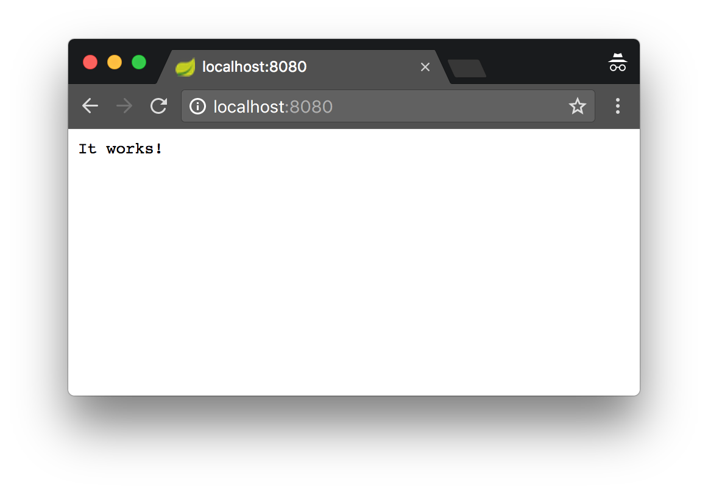

# Vert.x-Spring-Boot Example

## License

By using this software you accept the license agreement.

## About

Simple application meant to serve as an example of
[Spring Boot](https://projects.spring.io/spring-boot/)
and [Vert.x](http://vertx.io) integration. Spring Boot
is used as application start-up engine and dependency injection
container whereas Vert.x is responsible for handing HTTP requests.

## It works!

Click [here](http://localhost:8080) to make sure it's up and running.
Default port is set to `8080`. You may change it in `application.properties`
file by modifying `server.port` property. If everything's fine you should see:

